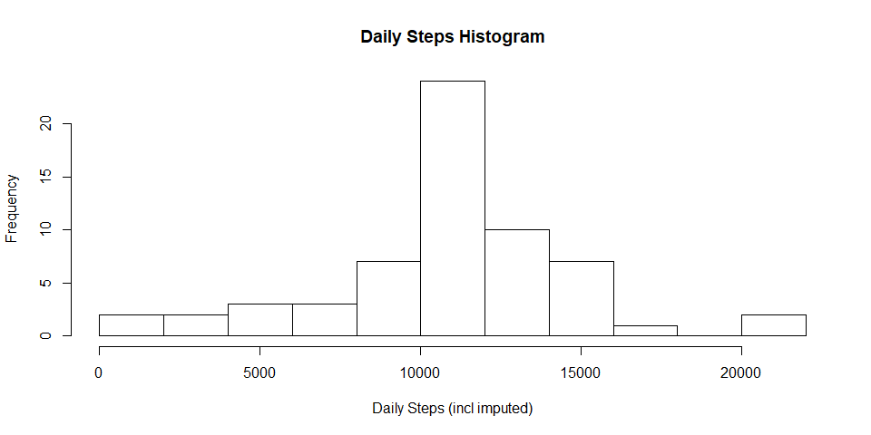
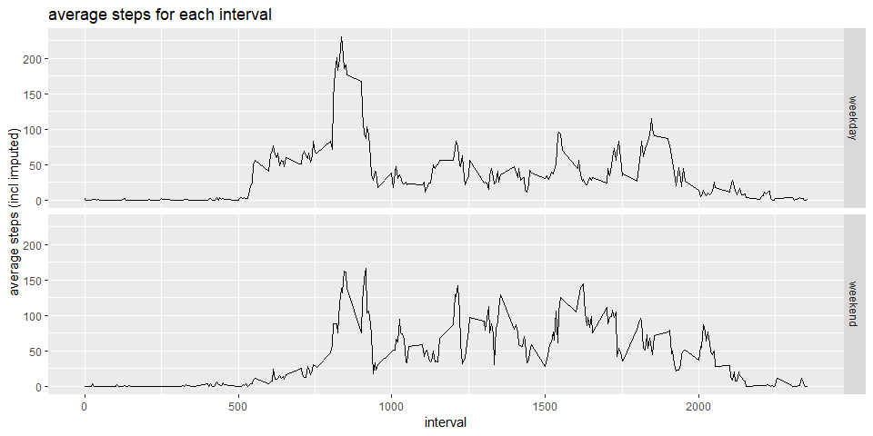

## Phil Ryan - 04 Dec 2018


This document was produced using R Markdown and the original notebook can be found in [Github](https://github.com/interpretstudio-phil/ReproducibleReasearchProject1)   

**Loading and preprocessing the data**  
Load the data downloaded from public online data source [here](https://d396qusza40orc.cloudfront.net/repdata%2Fdata%2Factivity.zip) and
transform the datatypes for analysis, specifically the date and increment to a 
date and datetime type 

```r
library('tidyverse')
library('lubridate')
library('ggplot2')
```


```r
act <- read.csv('Activity.csv')
act <- mutate(act, date=dmy(date))
str(act)
```

```
## 'data.frame':	17568 obs. of  3 variables:
##  $ steps   : int  NA NA NA NA NA NA NA NA NA NA ...
##  $ date    : Date, format: "2012-10-01" "2012-10-01" ...
##  $ interval: int  0 5 10 15 20 25 30 35 40 45 ...
```

```r
summary(act)
```

```
##      steps             date               interval     
##  Min.   :  0.00   Min.   :2012-10-01   Min.   :   0.0  
##  1st Qu.:  0.00   1st Qu.:2012-10-16   1st Qu.: 588.8  
##  Median :  0.00   Median :2012-10-31   Median :1177.5  
##  Mean   : 37.38   Mean   :2012-10-31   Mean   :1177.5  
##  3rd Qu.: 12.00   3rd Qu.:2012-11-15   3rd Qu.:1766.2  
##  Max.   :806.00   Max.   :2012-11-30   Max.   :2355.0  
##  NA's   :2304
```

**What is mean total number of steps taken per day?**  

```r
# remove NA's, group by each day and summarise the total steps
daily.act <- act %>% 
        filter(!is.na(steps)) %>% 
        group_by(date) %>% 
        summarise(steps=sum(steps,na.rm=TRUE))

# Steps by day
print(daily.act)
```

```
## # A tibble: 53 x 2
##    date       steps
##    <date>     <int>
##  1 2012-10-02   126
##  2 2012-10-03 11352
##  3 2012-10-04 12116
##  4 2012-10-05 13294
##  5 2012-10-06 15420
##  6 2012-10-07 11015
##  7 2012-10-09 12811
##  8 2012-10-10  9900
##  9 2012-10-11 10304
## 10 2012-10-12 17382
## # ... with 43 more rows
```

```r
# histogram of daily steps with 15 bins 
hist(daily.act$steps, breaks=15, xlab = 'Daily Steps', main = 'Daily Steps Histogram')
```

<!-- -->

```r
# display the mean and median daily steps
summary(daily.act$steps)
```

```
##    Min. 1st Qu.  Median    Mean 3rd Qu.    Max. 
##      41    8841   10765   10766   13294   21194
```
**What is the average daily activity pattern?**

```r
# Make a time series plot of the 5-minute interval (x-axis) and the average 
# number of steps taken, averaged across all days (y-axis)
# remove NA's, group by each day and summarise the total steps
intdaily.act <- act %>% 
        filter(!is.na(steps)) %>% 
        group_by(interval) %>% 
        summarise(steps=mean(steps))

#plot time series 
with(intdaily.act, plot(interval, steps, type='l', ylab='average steps'))
```

<!-- -->

```r
#determine which 5-min interval has the greatest average/mean
intdaily.act[which.max(intdaily.act$steps),]
```

```
## # A tibble: 1 x 2
##   interval steps
##      <int> <dbl>
## 1      835  206.
```
**Imputing missing values**

```r
# show summary stats including count of missing/NA observations
summary(act$steps)
```

```
##    Min. 1st Qu.  Median    Mean 3rd Qu.    Max.    NA's 
##    0.00    0.00    0.00   37.38   12.00  806.00    2304
```

```r
# for the NA observations replace with the rounded mean value for that interval
na.act <- act %>% 
        filter(is.na(steps)) %>% 
        select(date,interval) %>%
        left_join(intdaily.act) %>%
        mutate(steps=round(steps),date, interval)

imputed.act <- bind_rows(na.act,filter(act,!is.na(steps)))
imputeddaily.act <- imputed.act %>% group_by(date) %>% summarise(steps=sum(steps))

# histogram of daily steps with 15 bins 
hist(imputeddaily.act$steps, breaks=15, xlab = 'Daily Steps (incl imputed)', main = 'Daily Steps Histogram')
```

<!-- -->

```r
# display the mean and median daily steps
summary(imputeddaily.act$steps)
```

```
##    Min. 1st Qu.  Median    Mean 3rd Qu.    Max. 
##      41    9819   10762   10766   12811   21194
```
**Are there differences in activity patterns between weekdays and weekends?**

```r
# add a computed variable factor with two levels weekday and weekend
daytype.act <- mutate(imputed.act, daytype=factor(ifelse(wday(date, week_start=1)>5,'weekend','weekday')))

# summarise by day type and interval and average the steps
intdaytype.act <- daytype.act %>% 
        group_by(interval, daytype) %>% 
        summarise(steps=mean(steps))

g <- ggplot(intdaytype.act,aes(interval,steps)) + geom_line() 
g <- g + facet_grid(rows = vars(daytype)) + 
  labs(y='average steps (incl imputed)', title='average steps for each interval')
print(g)
```

<!-- -->

